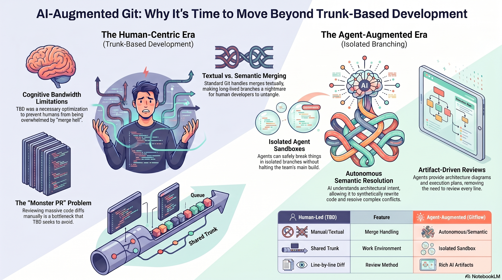

# Diffless: The AI-Augmented Git Workflow

**Version:** v0.0.1



Welcome to the **Diffless Workflow** repository. This project proposes a paradigm shift in version control and development lifecycles in the era of AI-augmented IDEs (such as Google Antigravity, Claude Code, Cursor, Codex, etc.).

## The Concept

For years, we've relied on **Trunk-Based Development (TBD)** as our defense mechanism against human limitations. Merging large branches textually in Git often creates a nightmare scenario called "merge hell," so TBD forced developers to commit thin, daily increments. 

However, with advanced LLM capabilities, an agent environment enables **Semantic Merging**. With AI handling code merging, the system doesn't just read Git diff text; it understands architectural intent, enabling synthetic code rewrites to resolve massive conflicts seamlessly. 

With these constraints broken, it’s time to move toward an **Agent-Augmented Gitflow**, powered by `git worktree` and managed via a dedicated CLI.

### Core Tenets

1. **Semantic Merging**: Eradicate "merge hell" by letting AI synthetically reconstruct conflicted code based on intent and functionality, replacing raw textual diffing.
2. **True Physical Sandboxes (via `git worktree`)**: If an AI agent operates in your main repository directory, it will overwrite your files and break your build. Using `git worktree`, AI agents instead check out into completely separate, hidden physical directories while sharing your exact `.git` database.
3. **Artifact-Driven PRs**: The "Monster PR" is dead. Agents replace raw 5,000-line diffs with rich Artifacts (videos, architectural diagrams, execution plans) that humans can quickly review conceptually.
4. **Gitflow CLI Abstraction**: Complex workspace management is abstracted into simple CLI commands that act natively as Agent Skills.

---

## The Diffless CLI (Current Progress)

To make this workflow effortless for both developers and AI, we are actively building the lightweight **Diffless CLI** in Go to wrap native `git worktree` commands.

We are implementing this CLI via a structured multi-phase architecture plan. You can view the full phase breakdown, including our implementation of physical sandboxes, semantic merging, and Antigravity Skill bindings, in the [Diffless Workflow Implementation Plan](docs/plan.md).

## Repository Structure

- **`cmd/diffless/`**  
  The main entry point for the compiled Go-based `diffless` CLI.
- **`internal/`**  
  The core Go logic housing `git` worktree wrappers, `antigravity` API integrations, and `cli` command routing.
- **`docs/plan.md`**  
  The step-by-step implementation plan for building the `diffless` CLI and enabling true physical agent sandboxing.
- **`docs/architecture.md`**  
  The high-level system topology outlining the interplay between the Go CLI, git worktrees, and IDE interceptors.
- **`docs/concept.md`**  
  The foundational theory detailing why TBD evolved for humans, and why `git worktree` sandboxes are necessary for AI.
- **`docs/Diffless.pdf`**  
  Detailed documentation showcasing the Diffless approach.
- **`assets`**  
  Contains visual assets like the infographic and the demo MP4 showcasing the workflow in action.

## Getting Started

1. Check out the infographic above for a clear visual representation of this shift.
2. Read the full problem statement and concept in [Concept](docs/concept.md).
3. Understand the underlying system design by reading the [Architecture](docs/architecture.md).
4. Follow the CLI architectural steps detailed in the [Diffless Workflow Plan](docs/plan.md).
5. Watch the demo video below to see the transition of standard diffing over to Artifacts.

## Installation

### Linux Mint / APT (Recommended Default)
The official global deployment standard is built natively for Linux Mint. You can compile the `.deb` package securely and register it system-wide by executing:

```bash
cd packaging/mint
./install.sh
```
This script will safely bind the CLI globally over `$PATH` and register the Antigravity IDE skill precisely to `~/.gemini/antigravity/skills/diffless/`.

### Generic Global Installation (Fallback Phase)
For non-Mint systems, use the standard fallback bootstrap directly in the repository root:
```bash
./install.sh
```

## Usage Guide

### 🚀 Google Antigravity Integration (Recommended)

Because Diffless ships directly with a standard Antigravity Skill package, it mounts effortlessly into the Antigravity IDE interface. You don't need to configure complex scripts—just talk to the agent naturally!

Here is an end-to-end workflow for building a new feature securely:

**1️⃣ Initialize the Sandbox**  
Open your repository in Google Antigravity. In the Chat window, ask the agent to start the feature:
> *"Use the diffless skill to start a new sandbox for `feature-login`."*
> 
> 🛠️ **What happens:** The IDE automatically discovers the global skill, auto-compiles the CLI, spawns a hidden physical `git worktree`, and locks down the environment boundaries with a secure `.env`.

**2️⃣ Build the Feature**  
Now that you are physically isolated, ask the agent to implement your logic. The agent is safe to experiment, install unverified dependencies, and overwrite code without touching your main `trunk`:
> *"Build a beautiful Vue login component. Make sure to include OAuth validation logic and run the test suite."*

**3️⃣ Sync & Resolve Drift**  
If the main `trunk` has progressed while the agent was building, invoke the sync loop to resolve drift. Instead of relying on raw text diffs, the agent resolves merge conflicts semantically based on intent:
> *"Diffless sync the current sandbox. Review any upstream changes from trunk and merge them logically into my login codebase."*

**4️⃣ Propose Changes for Review**  
When the code is ready, ask the agent to finalize the feature and generate a comprehensive proposal for your team to review (traditionally known as a Pull Request or Merge Request):
> *"Propose the `feature-login` via diffless."*
> 
> 🎬 **What happens:** Diffless orchestrates the IDE to package UI validation videos (via the Antigravity browser subagent), mermaid system architecture diagrams, and plain-English markdown execution plans into a cohesive review package. Instead of forcing your team to read thousands of lines of raw code changes, they can instantly understand the feature conceptually. No more raw "merge-hell"!

---

### Native Terminal Usage
To use the tool natively via standard shells, build the CLI manually and walk through the identical Agent lifecycle:

```bash
# 1. Start a New Feature Sandbox
# Creates an isolated, hidden physical Git worktree directory.
./diffless start feature-login

# 2. Lock Down the Sandbox
# Applies Zero-Trust permission sets (0700) and overrides production .env keys.
./diffless lockdown feature-login

# 3. Enter the Sandbox
# Native context switch navigating your shell/IDE into the isolated environment.
./diffless switch feature-login

# (AI/Developer builds the feature, tests logic, makes commits)

# 4. Semantic Merge & Rebase
# Resolves textual branch drift using intent-based AI logic rather than raw Git markers.
./diffless sync feature-login

# 5. Generative Pull Request
# Orchestrates UI video validation, markdown analysis, and mermaid system mapping.
./diffless propose feature-login

# 6. Safe Teardown
# Natively purges the physical directory and cleanly prunes the Git tree references.
./diffless clean feature-login
```

## Demo Video

https://github.com/SilverShaman/diffless/raw/main/assets/demo.mp4

---

## Tech Stack & Contributing

The `diffless` CLI is currently being built in **Go (Golang)**. This ensures that the tool is distributed as a lightweight, blazing-fast, compiled binary with zero external dependencies, making it painless to install across operating systems.

### License

This project is licensed under the **GNU General Public License v3.0 (GPL-3.0)**. 

We chose GPL-3.0 deliberately: we want to foster a thriving, organic open-source community that builds the standard for AI Git tooling. This license guarantees that the codebase will forever remain open—no commercial entity can fork this project into a closed-source, proprietary competitor. If you modify it, you share it!

We actively welcome contributors! Check out our [Implementation Plan](docs/plan.md) to see where the architecture is heading, and feel free to open a PR.
